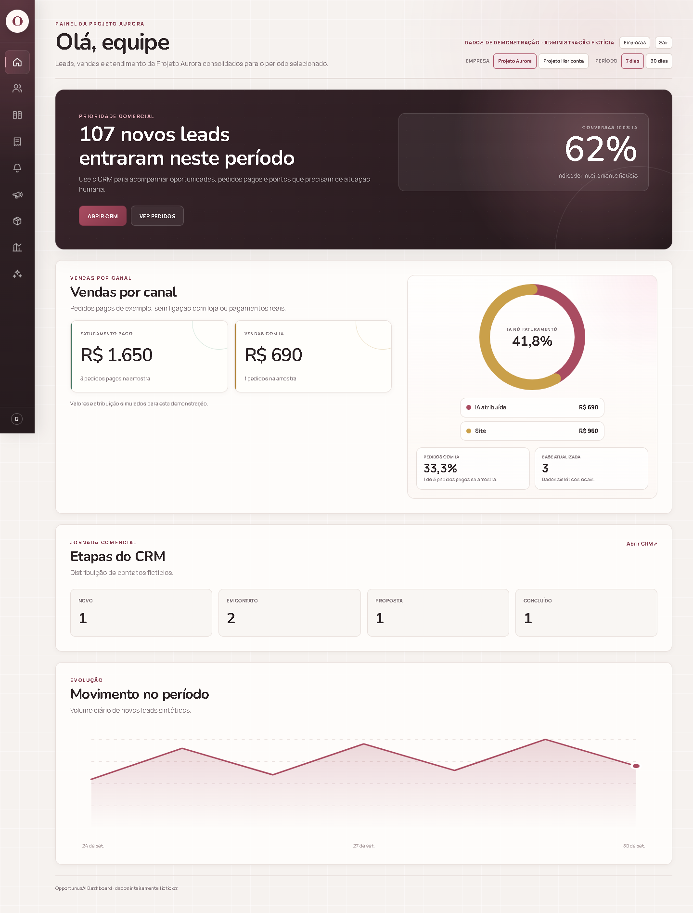

# OpportunusAI Dashboard

Dashboard comercial e operacional em Next.js, React e TypeScript. Esta versão executável usa duas empresas e três perfis **inteiramente fictícios**. O layout segue o painel da aplicação; indicadores, contatos, pedidos e sessões são locais e sintéticos.



## Explorar

| Rota | Conteúdo | Permissão |
| --- | --- | --- |
| `/` | Resumo, vendas por canal, CRM e evolução | Leitura do painel |
| `/clientes` | Seleção da empresa ativa | Sessão válida |
| `/leads` | Lista de contatos | Leitura de leads |
| `/crm` | Etapas e oportunidades | Gestão de CRM |
| `/pedidos` | Pedidos ilustrativos | Leitura de pedidos |
| `/follow-ups` | Fila ilustrativa, sem envio | Leitura administrativa |
| `/campanhas` | Ações fictícias, sem agendamento | Leitura administrativa |
| `/produtos` | Catálogo genérico | Leitura administrativa |
| `/historico` | Pedidos pagos da amostra | Leitura administrativa |
| `/operacao` | Volume de atendimento | Leitura operacional |
| `/api/tenants/:tenant/summary` | Resumo em JSON | Sessão e vínculo com a empresa |
| `/api/tenants/:tenant/leads` | Contatos em JSON | Sessão e vínculo com a empresa |
| `/api/tenants/:tenant/orders` | Pedidos em JSON | Sessão e vínculo com a empresa |
| `POST /api/auth/select-client` | Troca da empresa ativa | Sessão e vínculo com a empresa |

Há três perfis de exemplo: **Administração fictícia** acessa ambas as empresas; **Leitura Aurora** acessa apenas Aurora; **Administração Horizonte** acessa apenas Horizonte. A interface oferece somente empresas e rotas permitidas ao perfil. As páginas e APIs repetem a verificação no servidor.

## Executar localmente

Requisitos: Node.js 24.x e npm 11.x. Não é necessário banco, conta de nuvem, Cloudflare ou serviços externos.

```sh
npm ci
```

Crie um `.env.local` com duas sequências aleatórias e **diferentes**, cada uma com pelo menos 32 caracteres:

```dotenv
DEMO_ACCESS_KEY=<valor-aleatorio-local>
DEMO_SESSION_SECRET=<outro-valor-aleatorio-local>
```

No PowerShell, uma sequência pode ser gerada com `node -e "process.stdout.write(require('node:crypto').randomBytes(32).toString('hex'))"`. Gere duas e copie para o arquivo local. O arquivo é ignorado pelo Git; nunca use valores de produção.

```sh
npm run dev
```

Abra [http://localhost:3000/login](http://localhost:3000/login), escolha um perfil fictício e informe o valor de `DEMO_ACCESS_KEY`. Para verificar o candidato:

```sh
npm test
npm run typecheck
npm run build
npm run test:http
npm run security:secrets
npm run security:history
```

## Como o isolamento funciona

Uma sessão de demonstração é assinada no servidor e enviada em cookie `HttpOnly` e `SameSite=Strict`. O servidor verifica assinatura, validade, perfil, empresa ativa, vínculo e permissão da rota. A troca de empresa exige uma requisição autenticada e valida o vínculo novamente. APIs devolvem `401` sem sessão, `403` para outra empresa ou permissão negada e resposta privada sem cache quando autorizadas. Alterar `tenant` na URL não altera a empresa ativa. Requisições de login e seleção exigem a mesma origem e corpo limitado. A saída exige a mesma origem.

O mecanismo de entrada usa **uma chave local compartilhada e perfis simulados** para facilitar a exploração. Ele não é um provedor de identidade e não deve ser conectado a dados reais. O projeto não contém credenciais, URLs de serviços, banco, storage, envio de mensagens, checkout ou migrations de produção.

## Organização

```text
src/app/          telas e rotas HTTP
src/components/   navegação, cartões e gráficos
src/lib/          sessões, autorização, dados sintéticos e formatação
scripts/          verificação de credenciais em arquivos e histórico
tests/            isolamento, permissões, sessão e agregação
docs/images/      capturas com informações fictícias
```

Os conjuntos de Aurora e Horizonte são independentes. Os números das tabelas são amostras e podem ter escopo diferente dos totais por período. Todas as imagens foram renderizadas com dados sintéticos. Não inclua dados ou segredos reais em código, testes, capturas ou issues.

Os módulos de permissão, leitura limitada de requisições, respostas privadas, ícones e gráficos mantêm os padrões do painel original. Adapters e contexto de empresa foram ajustados para as duas entidades fictícias. Rotas de mutação comercial, integrações e migrations não fazem parte desta versão executável.
