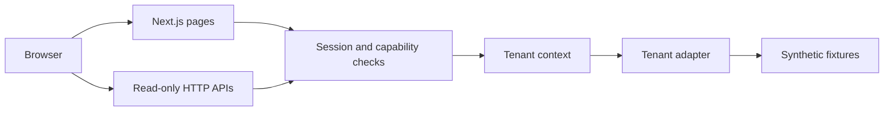

# Architecture

This executable dashboard keeps its data in local, fictional fixtures. It has no database connection, background worker, outbound messaging, or deployment-specific integration.

## Trust boundaries

- The login endpoint compares a local demo key and issues a signed session cookie with `HttpOnly` and `SameSite=Strict` attributes. The key and signing secret are supplied locally; neither is committed.
- The browser may request a tenant, but the server validates session signature, expiry, membership, active tenant, and route capability on every protected read. Interface filtering is an additional usability measure.
- Tenant adapters expose only the selected fictional organization's records. Unknown tenants, duplicate selections, and unsupported capabilities fail closed.
- Login and tenant-selection requests check origin and body size. Authenticated API responses use private, non-cacheable headers. Logout invalidates the browser cookie.

## Where to look

| Concern | Code |
| --- | --- |
| Pages and API endpoints | `src/app/` |
| Session creation and verification | `src/lib/demo-session*.ts` |
| Role and tenant authorization | `src/lib/access.ts`, `roles.ts`, `client-context.ts` |
| Request and response boundaries | `src/lib/request-security.ts`, `response-security.ts`, `http-security.ts` |
| Tenant adapters and fixtures | `src/lib/client-adapters.ts`, `demo-data.ts`, `demo-extra-data.ts` |
| Access and HTTP checks | `tests/` |

## Limits

The shared-key login and fictional roles are for local exploration. They do not replace a production identity provider. Fixtures do not model a production database, and the read-only APIs do not perform commercial actions. Do not connect this project to real customer data without a separate security design and review.
